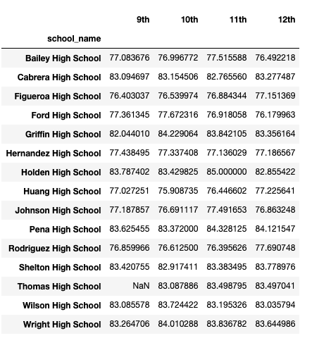

# School District Analysis
## Overview of the school district analysis: 
### Purpose
The purpose of this analysis is to assist Maria who is the chief data scientist for the city school district that is responsible of analyzing a variety of sources in a variety of formats. The task that was handed to her is to prepare all standardized test data for analysis, reporting, and presentation to provide insights about performance trends and patterns. Also to analyze and replace the math and reading scores for Thomas High School with NaNs while keeping the rest of the data intact. The school board has found evidence of academic dishonesty; specifically, reading and math grades for Thomas High School ninth graders appear to have been altered. The school board does not know the full extent of the academic dishonesty, they want to uphold state-testing standards. These insights are used to perform discussions and strategic descions at the schools district level. The task at hand is to help Maria analyze data on student funding and student standard test scores. The data that is given access is to are to every student's math and reading scores as well into on schools they attend. The task is to aggregate the data to showcase trends in school performance. This analysis will assist the school board and superintendent in making decisions in budgets and priorties, also will indicate the changes affected the overal analysis. In conclusion there has been a slight change in the overall analysis after changing Thomas High School ninth grade reading and math scores. 

## Results

- How is the district summary affected?
  - There were no change in the district summary from the change that was done on the dataset.
  
Original District Summary without Change

Revised District Summary with Change

- How is the school summary affected?
  - There is a slight change in results in the school summary of the dataset when Thomas High School ninth grade is replaced with NaN for the reading and math       scores. Comparing to the original school summary to the revised school summary the average math score decreased, average reading score increased, % passing       math decreased, % passing reading decreased, and the % overall passing decreased.
  
Original School Summary without Change

 
Revised School Summary with Change

 
 
- How does replacing the ninth graders’ math and reading scores affect Thomas High School’s performance relative to the other schools?
  - After replacing the ninth graders' math and reading scores there was no change in ranking remained second place, Thomas High School's performance is still in top five compared to     the other schools.
  
Original Top 5 Schools

Revised Top 5 Schools

  
How does replacing the ninth-grade scores affect the following:
 - Math and reading scores by grade
   - Replacing the ninth-grade scores caused a NaN to appear for grade 9, but there were no changes for the rest of the grades.
      
     Original Math Score by Grade
     
      
     Revised Math Score by Grade
     
     
     
     Original Reading Score by Grade
     
     
     Revised Reading Score by Grade
     
     
      
     
 - Scores by school spending
 - Scores by school size
 - Scores by school type

## Summary
Summarize four major changes in the updated school district analysis after reading and math scores for the ninth grade at Thomas High School have been replaced with NaNs.
